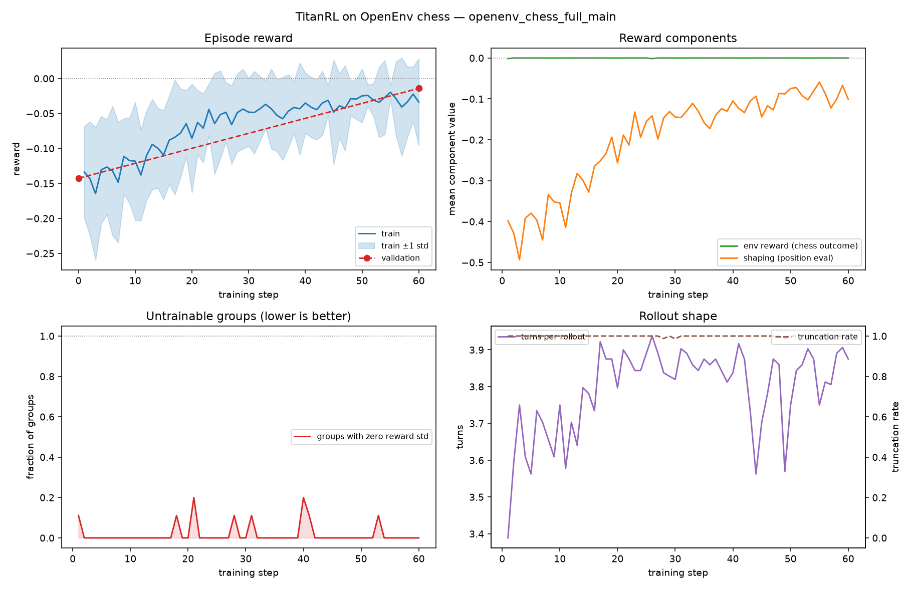

# TitanRL ↔ OpenEnv

Train on **OpenEnv environments** with **TitanRL** (PyTorch
[torchtitan](https://github.com/pytorch/torchtitan)'s `torchtitan/rl`), so an
OpenEnv server can drive GRPO / DAPO training the same way TitanRL's built-in
examples (e.g. `search_r1`) do.

The showcase trains **Muse Glimmer 30B** on OpenEnv's own
[`envs/chess_env`](../../envs/chess_env/) — a real, already-shipped OpenEnv
environment: multi-turn, adversarial (moonfish plays the other side), with a
per-step reward signal the rubric can consume directly. Nothing about the
integration is chess-specific; a one-line config change points it at any other
OpenEnv environment.

This example is **purely additive on the OpenEnv side** — it adds no code to
OpenEnv's core and no code to torchtitan. It shows that *OpenEnv is compatible
with TitanRL and TitanRL can be trained on OpenEnv environments* by supplying a
small adapter that speaks both protocols.

## 🎯 What this example shows

- **OpenEnv → messages**: a framework-agnostic bridge that turns any OpenEnv
  environment (over the standard HTTP/WebSocket protocol) into message-space
  turns, in either *tool-call* or *plain-text* action modes.
- **TitanRL `MessageEnv`**: a thin adapter that plugs that bridge into the
  `MessageEnv` contract TitanRL's rollouter expects (`init` + `step`).
- **A real environment, end to end**: OpenEnv's chess environment played
  move-by-move, with illegal moves rejected (`-0.1`) and the game result
  (`±1.0`) flowing into the rubric as the training reward.
- **A full TitanRL recipe**: dataset, reward function, rollouter, and GRPO
  configs for **Muse Glimmer 30B** (and a small Qwen3-1.7B variant for
  smoke-testing) — the `search_r1` recipe with the environment swapped for
  OpenEnv.
- **A live, dependency-light proof**: a standalone demo and test suite that
  serve real OpenEnv environments and drive them end-to-end **without torch,
  torchtitan, or a GPU**.

## 📁 Files

| File | Depends on | Purpose |
| --- | --- | --- |
| `openenv_bridge.py` | `openenv` only | Framework-agnostic OpenEnv ↔ message-space bridge (`OpenEnvBridge`, `BridgeTurn`, `render_observation`, `normalize_tool_call`, `DEFAULT_ACT_TOOL`). |
| `tasks.py` | `openenv` only | `TaskProfile`s — the per-environment instruction, tool schema, observation renderer, and optional reward shaping. Ships `chess` and `generic`. |
| `serve_chess.py` | `openenv`, `python-chess`, `moonfish` | Serves `envs/chess_env` with enough session capacity for a batch of concurrent rollouts (see [Serving the environment](#-serving-the-environment)). |
| `titanrl_env.py` | `torchtitan` | `OpenEnvMessageEnv` — the TitanRL `MessageEnv` wrapper around the bridge. |
| `data.py` | `torchtitan` | `OpenEnvSample` / `OpenEnvDataset` — per-rollout inputs. |
| `rubric.py` | `torchtitan` | `OpenEnvReward` — aggregates OpenEnv's per-step rewards into the scalar TitanRL's rubric needs — and `OpenEnvShapingReward`, the same over a shaping key. |
| `config_registry.py` | `torchtitan` | `_openenv_chess_rollouter_config()` (datasets + `OpenEnvMessageEnv` + rubric + token budget, as a plain TitanRL `Rollouter.Config`) and the runnable GRPO recipes: `rl_grpo_muse_glimmer_30b_openenv_chess()`, its `_smoke` variant, and `rl_grpo_qwen3_1_7b_openenv_chess()`. |
| `run_bridge_demo.py` | `openenv`, `python-chess`, `moonfish` | Standalone end-to-end demo: serves `envs/chess_env` in-process and plays it via the bridge. |
| `plot_run.py` | `matplotlib`, `tensorboard` | Turns a run's dump folder into the figures below. |
| `tests/test_bridge.py` | `openenv` only | Unit tests + live in-process round-trip tests. |
| `tests/test_recipes.py` | `torchtitan` | Builds every recipe on CPU through TitanRL's `ConfigManager` and scores rollouts through its `Rubric`; skipped without TitanRL. |
| `tests/tiny_env.py` | `openenv` only | A dependency-free OpenEnv env so the tests run without the chess extras. |

The split is deliberate: everything that talks to OpenEnv lives in
`openenv_bridge.py` / `tasks.py` and imports **only** `openenv`, so it is fully
usable and testable without a training stack. Importing the package
(`import titanrl_openenv`) exposes the bridge and task profiles eagerly and the
torchtitan-backed symbols lazily, so bridge-only usage never pulls in `torch`.

## 🏗️ How it fits together

```
TitanRL rollouter
      │  init() / step(completion_message)
      ▼
OpenEnvMessageEnv (titanrl_env.py)      ← MessageEnv contract (needs torchtitan)
      │  start() / act_from_tool_calls() / act_from_text()
      ▼
OpenEnvBridge (openenv_bridge.py)       ← translation only (needs openenv)
      │  + TaskProfile (tasks.py): instruction, tool schema, observation renderer
      │  reset() / step(action_dict)
      ▼
GenericEnvClient  ──HTTP/WebSocket──►  any OpenEnv environment server
```

- **Task profiles.** A `TaskProfile` holds the things that *are*
  environment-specific: the opening instruction, the tool the model calls, how
  to render that environment's observation, and optionally how to shape its
  reward. Configs select one by name (`message_env.task`), so they stay plain
  dataclasses.
- **Action modes.** In `tool` mode the model calls the task's tool — for chess,
  `chess_move(move="e2e4")`, whose arguments *are* the OpenEnv `ChessAction`. In
  `text` mode the model's message text is placed under a configurable action
  field. The `generic` profile's `openenv_act` tool takes a free-form `action`
  object for environments without a profile.
- **Rewards.** OpenEnv reports a reward per step; the bridge forwards it into
  each turn's `env_rewards`, and `OpenEnvReward` sums them, so the
  environment's own reward drives training — for chess, `-0.1` per rejected
  move plus `+1 / 0 / -1` for win / draw / loss. For chess that reward alone is
  too sparse to train on, so the profile adds a dense shaping term; see
  [Making a sparse environment trainable](#-making-a-sparse-environment-trainable).

## 📦 Installing the dependencies

The example is layered so you only install what the part you want actually
needs. Steps 1–3 run from the **OpenEnv repo root**; step 4 from a torchtitan
checkout.

| What you want to run | Install | Needs a GPU |
| --- | --- | --- |
| Bridge, task profiles, `tests/test_bridge.py` | `pip install -e . pytest pytest-asyncio` | no |
| …plus the chess demo and `serve_chess.py` | `+ pip install python-chess moonfish` | no |
| …plus `plot_run.py` | `+ pip install matplotlib tensorboard` | no |
| The TitanRL recipes (`config_registry.py`, `tests/test_recipes.py`) and training | a torchtitan checkout + its training stack | training only |

### 1–3. Everything except training (CPU, no torchtitan)

```bash
# 1. Bridge + tests — openenv only. This is enough to prove the integration.
#    (The tests are async; OpenEnv declares pytest-asyncio only in its dev group.)
pip install -e . pytest pytest-asyncio
export PYTHONPATH="examples:${PYTHONPATH}"

# 2. The chess environment itself (envs/chess_env's own deps: it declares
#    python-chess and moonfish in envs/chess_env/pyproject.toml).
pip install python-chess moonfish

# 3. Plotting a finished run from its TensorBoard events.
pip install matplotlib tensorboard
```

### 4. TitanRL (for training only)

TitanRL is torchtitan's `torchtitan/rl`, and it is **used from a checkout on
`PYTHONPATH`, not pip-installed** — its Monarch-spawned worker processes inherit
that variable and import the local package. Use torchtitan `main`. TitanRL's
[`torchtitan/rl/README.md`](https://github.com/pytorch/torchtitan/blob/main/torchtitan/rl/README.md#prerequisites)
is the source of truth; these are the steps that produced the run below, on
H100s:

```bash
git clone https://github.com/pytorch/torchtitan.git
cd torchtitan

pip install uv
uv venv --python 3.12 titan-rl && source titan-rl/bin/activate

# torchtitan's own requirements -- renderers, wandb, tensorboard, torch_remat.
# TitanRL's Quick Start skips this because its CI image bakes it in.
uv pip install -r requirements.txt

# Monarch, TorchStore
uv pip install -r torchtitan/rl/requirements.txt
uv pip install --no-deps "git+https://github.com/meta-pytorch/torchstore.git@main"

# Flash Attention 3 on Hopper (H100/H200, SM90). Blackwell uses FA4 instead;
# see the TitanRL README for its apache-tvm-ffi caveat.
uv pip install flash-attn-3 --extra-index-url=https://download.pytorch.org/whl/test/cu130

# torch / torchvision / vLLM nightlies, installed together: each vLLM nightly
# pins one exact torch nightly.
uv pip install torch torchvision vllm --pre \
    --extra-index-url https://download.pytorch.org/whl/nightly/cu130 \
    --index-strategy unsafe-best-match

# This example: openenv for the bridge, pytest for tests/test_recipes.py.
uv pip install -e /path/to/OpenEnv pytest pytest-asyncio

export PYTHONPATH="$PWD:/path/to/OpenEnv/examples:${PYTHONPATH}"
```

**Leave `torchcomms` out of the nightly line**, although TitanRL's Quick Start
lists it. Its nightly pins an older torch, so uv quietly resolves torch and vLLM
back to that older build instead of the current one. TitanRL does not import
torchcomms, and single-node weight sync goes through shared memory without it.

You also need the **model assets** at
`torchtitan/rl/example_checkpoint/Muse-Glimmer-30B`, the recipe's
`hf_assets_path` (relative to the torchtitan root). From the torchtitan root:

```bash
python scripts/download_hf_assets.py \
    --repo_id meta-models/Muse-Glimmer-30B \
    --local_dir torchtitan/rl/example_checkpoint \
    --all
```

Keep `--all`: the directory must contain **`chat_template.jinja`**, and weights
alone are not enough — without the template the renderer produces empty
completions, the model never emits a tool call, and the run looks exactly like
the reward-sparsity failure described below. The small Qwen3-1.7B recipe reads
`torchtitan/rl/example_checkpoint/Qwen3-1.7B`; fetch it the same way with
`--repo_id Qwen/Qwen3-1.7B`.

The versions the run in [Results](#-results) was produced with, for reference:
torchtitan `main`, `torch 2.15.0.dev20260926+cu130`,
`vllm 1.0.0.dev20260926+cu130`, `torchmonarch 0.6.0`, `flash-attn-3 3.0.0`,
`apache-tvm-ffi 0.1.11`, `renderers 0.1.11`, `transformers 5.17.0`, no
`torchcomms`; and for the environment server, `openenv 0.6.1.dev0` with
`chess 1.11.2` (installed by `python-chess 1.999`) and `moonfish 0.0.1`.

> **The environment server does not have to share an environment with the
> trainer.** It is a separate process speaking HTTP/WebSocket, so the run above
> served chess from a small CPU-only venv (openenv + python-chess + moonfish)
> while the trainer ran from a separate GPU venv that has no chess packages in
> it at all. That split is the point of the bridge.

## 🚀 Quick start (no torchtitan, no GPU)

With steps 1 and 2 above installed:

```bash
# Serves envs/chess_env in-process and plays it through the bridge in both
# tool and text modes — including a deliberately illegal move, to show how the
# environment's rejection reward surfaces back to the model.
python examples/titanrl_openenv/run_bridge_demo.py

# Run the tests (unit + live in-process WebSocket round-trips). The 7 tests
# that need the real chess env are skipped if python-chess/moonfish are missing.
pytest examples/titanrl_openenv/tests/test_bridge.py -v   # 54 passed
```

Expected demo output (abridged):

```
=== tool mode (assistant calls chess_move) ===
reset ->
Position (FEN): rnbqkbnr/pppppppp/8/8/8/8/PPPPPPPP/RNBQKBNR w KQkq - 0 1
Side to move: white
Legal moves (20): g1h3, g1f3, b1c3, ...

illegal 'a1a8'  -> reward=-0.1 done=False
Your previous move was rejected (not a legal UCI move) and was not played. ...
move 1 'h2h4'   -> reward=0.0 done=False
```

With TitanRL installed (step 4), `tests/test_recipes.py` additionally builds
every recipe on CPU — no GPU, weights, or server — and scores hand-built
rollouts through TitanRL's own `Rubric`. Run it from the torchtitan root with
the `PYTHONPATH` above:

```bash
pytest /path/to/OpenEnv/examples/titanrl_openenv/tests/test_recipes.py   # 32 passed
```

Point the bridge at your own environment by changing `base_url`:

```python
from examples.titanrl_openenv.openenv_bridge import OpenEnvBridge

bridge = OpenEnvBridge(base_url="http://localhost:8010", action_mode="tool")
turn = await bridge.start(seed=0)  # reset -> first observation
turn = await bridge.act_from_text("hello")  # or act_from_tool_calls([...])
print(turn.text, turn.reward, turn.done)
await bridge.stop()
```

## 🔌 Serving the environment

For training, start the server with:

```bash
python examples/titanrl_openenv/serve_chess.py \
    --max-sessions 512 --workers 16 --agent-color white   # port 8000
```

That is the whole setup. The defaults are already the values above, so bare
`python examples/titanrl_openenv/serve_chess.py` works too; the flags are spelled
out because each one exists for a reason described below.

For *trying* the environment by hand, `python -m envs.chess_env.server.app` is
still the right launcher (`run_bridge_demo.py` likewise serves a single-session
app in-process). It just cannot feed a training batch.

### Why the stock launcher is not enough

`create_app` defaults to `max_concurrent_envs=1`, and `HTTPEnvServer` refuses a
higher cap unless the environment class sets `SUPPORTS_CONCURRENT_SESSIONS =
True`. `ChessEnvironment` does not set it, even though it is safe to run
concurrently: the server builds one environment instance per session, each with
its own `chess.Board`, and moonfish's `search_move` takes the board as an
argument rather than holding engine state. Rather than patch the environment,
`serve_chess.py` opts in from the example with a one-line subclass.

Three sizing decisions then follow.

**1. Size the session cap for the async loop's whole in-flight buffer, not one
step.** TitanRL keeps `(target_offpolicy_steps + 1) * num_prompts_per_train_step`
rollout groups active at once, each of `num_samples_per_prompt` rollouts.
Validation runs only before the first step and after the last, never alongside
training, so it matters only if it is larger:

```
max_sessions >= max((target_offpolicy_steps + 1)
                    * num_prompts_per_train_step
                    * num_samples_per_prompt,
                    validation.num_samples)
```

For the 30B recipe's defaults (`3, 8, 8, 64`) that is `4 * 8 * 8 = 256` — four
times a single step's 64 (TitanRL sizes vLLM's concurrency the same way, and
logs `rollout_concurrency=256`). The default of 512 leaves headroom; the cap is
only a ceiling and sessions are created lazily, so over-provisioning is free.
With `--workers` above 1 the cap applies **per worker process** (each has its own
session table), so the server as a whole admits more. Size it against the full
demand anyway: connections are not guaranteed to spread evenly across workers.

**2. Give it enough cores.** moonfish is pure Python, so every opponent reply
holds the GIL, and one uvicorn process answers them strictly one at a time.
Throughput is then a flat ~10 env steps/s whatever the load, so latency grows
linearly with concurrency (one worker, random legal moves):

| concurrent sessions | p50 step latency | env steps/s |
| --- | --- | --- |
| 1 | 0.09 s | 10.2 |
| 8 | 0.58 s | 11.0 |
| 32 | 2.94 s | 10.0 |
| 128 | 12.4 s | 10.4 |
| 256 | 23.6 s | 10.4 |

At the ~256 sessions this recipe keeps open, a single worker makes a four-turn
rollout wait over a minute for the opponent alone; a run served that way hit
NCCL's 600 s watchdog when the starved generator stalled the trainer.
`--workers 16` gives each process its own GIL. In the training runs the load
spread over all 16 workers, because rollouts open and close sessions
continuously while workers are busy. (uvicorn relies on the kernel to spread
connections, so a benchmark that opens hundreds of sessions in one burst can
land them all on one worker and see single-worker numbers — that is a property
of the benchmark, not of training.)

**3. Pin the agent's colour** with `--agent-color white`; see
[Making a sparse environment trainable](#-making-a-sparse-environment-trainable)
for why a mixed-colour GRPO group is not one task.

### Troubleshooting

A healthy run's server log is one `"WebSocket /ws" [accepted]` + `connection
open` pair per rollout and nothing else — no `ERROR` or `WARNING` lines.

Everything in this table is genuine misconfiguration. None of it should appear
in a correctly configured run — it is recorded because two of the three point
nowhere near the actual cause.

| What you see | What it means | Fix |
| --- | --- | --- |
| `Server error: Server at capacity: 1/1 sessions active. Cannot accept new connections. (code: CAPACITY_REACHED)` | The stock launcher, or `--max-sessions 1`. | Use `serve_chess.py`. |
| Rollouts scored `ERROR` with `websockets.exceptions.ConnectionClosedOK`, and few or no `CAPACITY_REACHED` messages | **Session cap too low.** Over the cap the server accepts the WebSocket, sends `CAPACITY_REACHED` and closes it, but most clients see only the close and die on their first message (an undersized run logged 8 `CAPACITY_REACHED` against 248 `ConnectionClosedOK`) — an undersized server looks like a flaky network, not a full one. | Raise `--max-sessions` per the formula above. |
| `[rank1] Operation timed out after 600491 ms` / `SupervisionError: Endpoint call trainer.forward_backward_steps() failed` | **Some rank stalled and the rest waited in a collective** until NCCL's 600 s watchdog aborted them — a distributed-training stack trace that says nothing about the cause. Three different causes produced it here: a server too slow for the load (the generator starves), a trainer rank out of GPU memory (look for `OutOfMemoryError` or `expandable_segments: memory mapping failed with OOM` a few minutes earlier), and a generator capped at `gpu_memory_limit=0.6`. | Check the log just before the timeout. `--workers 16` for the server; bf16 Adam moments for trainer memory (see [Hardware](#hardware)); keep `gpu_memory_limit` at 0.9. |

A run quietly discarding a third of its rollouts looks a lot like a run that is
merely learning slowly, so it is worth checking the server log before believing
a flat reward curve.

## 🎲 Making a sparse environment trainable

Chess pays `±1.0` for a decided game, `-0.1` for an illegal move, and **0.0 for
every legal non-terminal move**. A rollout is a partial game of a few moves, so
in practice the only payout is 0.0 — in a smoke run without shaping, every one
of the 105 recorded env steps scored exactly `{'openenv': 0.0}`. GRPO learns from
*within group* reward spread, so identical siblings mean zero advantage
everywhere, and TitanRL's batcher eventually aborts the run with, e.g.:

```
RuntimeError: 10 consecutive untrainable batches (40 rollout groups);
check reward diversity and training-sample filters.
```

The environment already reports what breaks the tie: moonfish's static
evaluation of the resulting position, in `metadata["evaluation"]` on every step.
`chess_position_rewards` squashes it to `tanh(evaluation / 200)` and reports it
under a second `env_rewards` key, which `OpenEnvShapingReward` scores at weight
`0.5` next to the environment's own reward at `1.0`. The first five rollouts
recorded in the run below (step 1) show the difference:

| rollout (group/sibling) | turns | `openenv` (summed) | `position` (final) |
| --- | --- | --- | --- |
| 2/1 | 3 | 0.0 | −0.41 |
| 2/0 | 4 | 0.0 | −0.08 |
| 15/6 | 3 | 0.0 | −0.41 |
| 15/2 | 4 | 0.0 | −0.38 |
| 10/0 | 3 | 0.0 | −0.41 |

No sign correction is needed mid-game: moonfish evaluates from the side to
move's point of view, and the agent is the side to move in every ongoing
observation (the environment plays the opponent's reply before returning), for
either color. A finished game is scored by its outcome instead — +1 / 0 / −1 for
a win / draw / loss — since after the agent's own game-ending move the opponent
never replies and the evaluation would be from the other side.

> **Do not reach for `Rubric.Config.truncation_reward` here.** It looks like the
> fix — penalize the rollouts that ran out of tokens — but it *short-circuits
> the reward fns entirely* for any status where `is_truncated()` is true, and
> that includes `truncated_max_turns`. In a partial-game task no rollout ever
> reaches `completed`, so setting it flattens every reward in the run to the
> same constant and makes the problem worse.

This is the general pattern for any sparse OpenEnv environment: put the dense
signal in the `TaskProfile`'s `shaping` hook and score it with its own
`OpenEnvShapingReward`, leaving the environment's real reward as the dominant
term.

## 🏋️ Training with TitanRL

This part needs a torchtitan checkout (TitanRL lives at `torchtitan/rl`) plus
its training dependencies — see
[Installing the dependencies](#-installing-the-dependencies).

1. **Start the OpenEnv chess server** as above (any environment works; chess is
   the default). It can live in its own venv on its own cores.

2. **Launch TitanRL training** from the torchtitan root (the recipe's
   `hf_assets_path` is relative to it), making this example importable as a
   module. `ConfigManager` discovers the recipe from the module's
   `config_registry`:
   ```bash
   cd /path/to/torchtitan
   export PYTHONPATH="$PWD:/path/to/OpenEnv/examples:${PYTHONPATH}"
   python -m torchtitan.rl.train \
       --module titanrl_openenv \
       --config rl_grpo_muse_glimmer_30b_openenv_chess \
       --dump-folder outputs/rl/openenv_chess
   ```

   Use `--config rl_grpo_muse_glimmer_30b_openenv_chess_smoke` for a five-step
   shakeout on the same hardware, or `--config rl_grpo_qwen3_1_7b_openenv_chess`
   to exercise the pipeline at small scale. The recipes log to W&B — run
   `wandb login` first, or pass `--metrics.no-enable-wandb`; TensorBoard events
   are written to the dump folder either way.

   Use a **fresh `--dump-folder` per run.** The trainer resumes from any
   checkpoint it finds there, and TensorBoard events and `rollout_samples.jsonl`
   append to what is already there.

   If the launcher reports `Config function '...' not found in titanrl_openenv`,
   the recipe module failed to import: `ConfigManager` falls back to the package
   and reports only that. `python -c "import titanrl_openenv.config_registry"`
   shows the real error.

   Set `no_proxy` to include `127.0.0.1` if your shell has a proxy configured:
   the rollout workers inherit it, and would otherwise send every env step to the
   proxy, which rejects it. (`USE_TORCHCOMMS_RDMA=0` matters only if you did
   install torchcomms on a box without InfiniBand — TorchStore then probes its
   RDMA transport and can hang.)

The recipes mirror torchtitan's `search_r1` GRPO setup (DAPO loss, vLLM
generator); only the rollouter — dataset, environment, and rubric — is swapped
for the OpenEnv-backed one. The Muse Glimmer recipe inherits that model's two
requirements from `search_r1`: generator tensor parallelism ≤ 2 (the model has
2 KV heads) and `FullAC` activation checkpointing (`SelectiveAC` OOMs when Adam
allocates `m`/`v` at step 2).

### Hardware

The 30B recipe is written for **one 8×H100 node with ~95 GiB cards** (the run
below: 97,871 MiB each), split between the two roles TitanRL runs concurrently:

| GPUs | Role | Parallelism | Config |
| --- | --- | --- | --- |
| 6 | **Trainer** — forward/backward, optimizer, checkpoints | FSDP=3 × TP=2 | `parallelism=ParallelismConfig(data_parallel_shard_degree=3, tensor_parallel_degree=2)` |
| 2 | **Generator** — vLLM, serves the rollouts | TP=2 | `parallelism=InferenceParallelismConfig(data_parallel_degree=1, tensor_parallel_degree=2)` |

Both roles run at once — the generator produces rollouts against the OpenEnv
server while the trainer consumes finished ones, and the trainer pushes new
weights to the generator each step. The environment server itself needs **no
GPU**; it wants cores (see `--workers` above), and it can run on a different
machine entirely if you point `base_url` at it.

Four things constrain this layout, and all four were found by hitting or
measuring them:

- **Adam's moments are kept in bf16** (`AdamW.Config(..., moment_dtype="bfloat16")`;
  parameters and updates stay fp32), and at this size that is what makes the
  layout fit. TitanRL's weight push to the generator holds a bf16 copy of every
  weight shard (~8.7 GiB per trainer GPU) and, right after a mid-run checkpoint
  save, overlaps the next forward/backward. With fp32 moments that needs
  ~91 GiB, and the trainer runs out of memory at the first step after a mid-run
  checkpoint; with bf16 moments it peaks at ~79 GiB reserved (~88 GiB — 89,807 MiB — in
  `nvidia-smi`, NCCL and CUDA context included). 80 GB H100s still do not fit as configured; use
  more trainer GPUs or a shorter context.
- **Generator TP cannot exceed 2.** Muse Glimmer has 2 KV heads, so attention
  cannot be tensor-split further. Scale the trainer with FSDP instead.
- **`FullAC` is required, not an optimization.** Adam's `m`/`v` are allocated on
  the *first* `optimizer.step()`, so per-GPU memory jumps between step 1 and
  step 2; with the default `SelectiveAC` that jump OOMs.
- **Leave `gpu_memory_limit` at its 0.9 default**, as torchtitan's own Muse Glimmer
  30B recipe does. At TP=2 the weights take ~26 GiB per card, so 0.6 (the value
  torchtitan's Qwen3-8B recipe uses) leaves ~28 GiB of KV cache where 0.9 leaves
  ~57 GiB. A run capped at 0.6 hit NCCL's watchdog at step 3, with generator
  decode times around 130 s and requests queueing in vLLM; the 0.9 runs did not.
  Its log shows no KV-cache preemption, so the exact mechanism is not
  established — only that 0.6 failed and 0.9 has not.

Smaller hardware: `rl_grpo_qwen3_1_7b_openenv_chess` is the same integration on
5 GPUs (1 trainer TP=1 + 4 generator TP=4), mirroring `search_r1`'s Qwen3-1.7B
layout — it builds and passes `tests/test_recipes.py`, but was not trained as
part of verifying this example. `rl_grpo_muse_glimmer_30b_openenv_chess_smoke`
is the 30B layout with a 4×4 batch and 5 steps.

One more constraint is specific to this task: **budget tokens for the *last*
move, not the first.** Muse Glimmer's reasoning grows with the game history —
in the run below, completions averaged ~380 tokens on move 1, ~870 on move 2 and
~1,600 on moves 3 and 4 — and a turn cut off before its tool call is a wasted
turn. At `max_tokens=384` every rollout was `truncated_length`; at 1536 only 27%
of third moves still reached the tool call. The recipe uses `max_tokens=2560`,
where about a quarter of third and fourth moves still hit the cap; what bounds
it is the context. `max_tokens`, the 12288-token context and the 4-turn cap
have to be raised together: a rollout reaches the trainer as one sample — the
last turn's prompt plus its completion — and the batcher drops (with only a
warning) any sample longer than `max_context_length`. `max_rollout_tokens` does not prevent that on
its own, since it only caps the prompt *before* each turn.

If your server is not on `127.0.0.1:8000`, override it on the command line —
`--rollouter.worker.message-env.base-url http://my-host:8010` — or, for anything
more involved (a different environment, say), derive a config:

```python
# my_runs.py  ->  --module my_runs --config chess_on_my_host
import dataclasses
from titanrl_openenv.config_registry import rl_grpo_muse_glimmer_30b_openenv_chess


def chess_on_my_host():
    config = rl_grpo_muse_glimmer_30b_openenv_chess()
    config.rollouter.worker.message_env.base_url = "http://my-host:8010"
    return config
```

## 📈 Results

Muse Glimmer 30B, 60 GRPO/DAPO steps on OpenEnv's `envs/chess_env`, run with
`rl_grpo_muse_glimmer_30b_openenv_chess` on torchtitan `main` on one
8×H100 node ([layout above](#hardware)) against a 16-worker `serve_chess.py`
running OpenEnv `0.6.1.dev0`.
W&B: [`openenv-titanrl-chess/j0j7p50q`](https://wandb.ai/a-shamsoshoara-m/openenv-titanrl-chess/runs/j0j7p50q).

> **Why 60 steps?** It is a demonstration budget, not a convergence point. The
> recipe's own default is 500 (`--async-loop.num-training-steps` overrides it),
> which at ~3.6 min/step would be about 30 hours. 60 was chosen because it clears
> the `interval=50` checkpoint, so the run exercises a mid-run DCP save *and*
> training after it — the point where fp32 Adam moments run out of memory (see
> [Hardware](#hardware)) — and because ~4 hours fits a single session on a
> shared box.



The panels come straight from the run's own TensorBoard events —
reproduce them with

```bash
# from the OpenEnv root; the dump folder is wherever training wrote it
python examples/titanrl_openenv/plot_run.py /path/to/torchtitan/outputs/rl/openenv_chess \
    --out examples/titanrl_openenv/assets
```

**The model learns.** Mean episode reward climbs from **−0.13 at step 1 to
−0.03 by the end** — steadily for the first ~30 steps, then more slowly:

| steps | 1–5 | 16–20 | 26–30 | 41–45 | 56–60 |
| --- | --- | --- | --- | --- | --- |
| `rollout_reward/_mean` (5-step mean) | −0.140 | −0.080 | −0.051 | −0.040 | −0.032 |

TitanRL's held-out validation pass, run before the first step and after the
last, agrees — and shows the improvement is not the policy collapsing onto one
safe line, since the spread shrinks tenfold along with the deficit:

| | pre-training | post-training |
| --- | --- | --- |
| `validation_reward/_mean` | −0.143 | **−0.014** |
| `validation_reward/_min` | −0.324 | −0.030 |
| `validation_reward/_max` | −0.026 | −0.007 |
| `validation_reward/_std` | 0.089 | 0.009 |
| component `OpenEnvShapingReward` | −0.428 | −0.042 |
| component `OpenEnvReward` | 0.000 | 0.000 |

Read in chess terms: the position after four moves went from *clearly worse for
the agent* to *about level*, against moonfish at depth 1.

**What the other panels say.** The components panel shows exactly why the
shaping term exists — `OpenEnvReward`, the environment's own reward, stays at
**0.000** (bar two illegal moves, at steps 1 and 26), because no 4-move rollout
ever reaches a decided game. Essentially all of the gradient comes from the
shaped position score. The
trainability panel is the one to watch on any new environment: zero-std groups
appeared on **8 of 60 steps**, never above 0.20, against the
1.0-for-10-consecutive-steps that aborts a run. And turns per rollout *rose*
from ~3.4 to ~3.9 as the model got better at spending its token budget on the
move rather than on reasoning that gets truncated.

**Run health.** 60/60 steps, **0 OOMs, 0 NCCL timeouts** — including through
the step-50 checkpoint, where the trainer's memory peaked at 73.9 GiB active /
78.7 GiB reserved while the weight push overlapped the next step on three ranks.
Checkpoints saved at steps 50 and 60 (208 GiB each, ~4 min each). **4 errored
rollouts** out of ~4,000: the model occasionally emits a schema-invalid
`chess_move` (a missing, extra, or non-string argument), which OpenEnv's action
validation rejects before the environment sees it. The rollout then has no
completed turn, so TitanRL drops its whole group of 8 from training — 4 groups,
32 rollouts (any *string* move, even an illegal one, is scored normally at
−0.1). Wall clock
≈ 3 h 37 min for the 60 steps (≈ 3.6 min/step), ≈ 4 h including load and both
validation passes. The chess server served every session with no errors.

`plot_run.py` also summarizes `rollout_samples.jsonl`:

```json
{
  "recorded_train_rollouts": 1022,
  "validation_rollouts": 128,
  "groups": 511,
  "statuses": {"truncated_max_turns": 647, "truncated_length": 371, "error": 4},
  "turns": {"0": 4, "2": 15, "3": 212, "4": 791},
  "distinct_rewards": 68,
  "nonzero_advantage": 1002
}
```

`truncated_*` is the expected status here, not a failure: a rollout is a
partial game, so it ends when it runs out of turns or tokens, never at
`completed`. 1002 of 1022 recorded rollouts carry a nonzero advantage.

> **bf16 moments are a memory trade-off.** They are what lets the 30B trainer
> fit here; if you have more trainer memory, fp32 moments (torchtitan's default)
> are worth trying — they may learn somewhat faster.

> These numbers are a **compatibility demonstration, not a chess result** —
> 60 steps at `lr=1e-6` against a depth-1 opponent, on a 4-move horizon. The
> point is that an unmodified OpenEnv environment drives a real TitanRL GRPO
> loop end to end and the reward moves in the right direction.

## 🧩 Adapting to a real task

- **Another OpenEnv environment, no code**: in a derived config set
  `message_env.task = "generic"` and point `base_url` at it. The model then
  calls `openenv_act` with a free-form `action` object matching that
  environment's action schema.
- **Another OpenEnv environment, properly**: add a `TaskProfile` to
  `tasks.py` — an instruction, a typed tool (set `tool_action_key=None` when the
  tool's arguments *are* the action, as with `chess_move`), and a renderer for
  that environment's observation — then select it by name.
- **Dataset**: replace `OpenEnvDataset` in `_openenv_chess_rollouter_config()`
  with your own `torchtitan.config.Configurable` dataset that yields
  `OpenEnvSample`s (`prompt`, `reset_kwargs`, optional `target`). `reset_kwargs` are forwarded to
  the server's `reset`; OpenEnv filters out any the environment doesn't accept.
- **Reward**: keep `OpenEnvReward` to use the environment's reward, or add
  reward functions to the `Rubric` for task-specific shaping (e.g. verifying a
  final answer against `env_input.target`).
