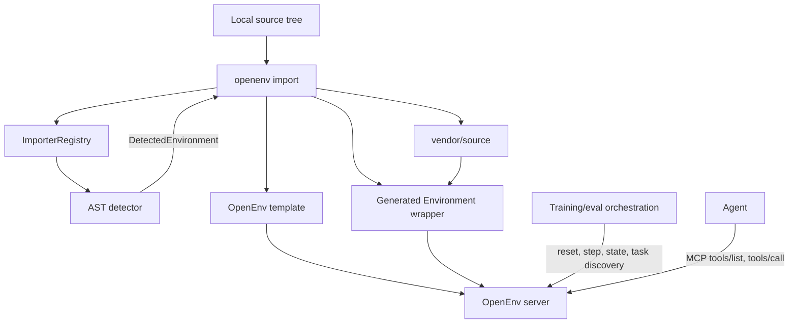

# RFC 006: External Environment Imports

**Status**: In Review
**Created**: 2026-06-01
**Authors**: @burtenshaw
**RFC ID**: 006

## Summary

This RFC proposes a deterministic import path for third-party environment
libraries. The import path turns a supported source repository into a normal
OpenEnv package, using the same generated project structure, container runtime,
typed wire models, and MCP-style tool interface as environments created with
`openenv init`.

The initial implementation targets ORS/OpenReward and Prime Intellect
Verifiers. It adds `openenv import SOURCE --name NAME --output-dir DIR`, an
importer registry, AST-based source detection, generated wrappers, optional
task/split discovery for dataset-backed environments, and MCP-style
`tools/list` and `tools/call` support for imported wrappers. This RFC documents
the design implemented in [PR #726](https://github.com/huggingface/OpenEnv/pull/726)
so the architectural decisions can be reviewed explicitly even though the code
already exists.

---

## Motivation

### Problem 1: External RL environment ecosystems already exist

OpenEnv should not require every environment author to rewrite existing work by
hand. ORS/OpenReward and Verifiers environments already encode useful tasks,
datasets, prompts, tools, and reward logic. Without an import path, using those
sources in OpenEnv requires ad-hoc rewrites that are hard to audit and easy to
diverge from the original environment.

### Problem 2: Importing arbitrary source code can be unsafe and non-deterministic

A naive importer would import user modules at discovery time, run arbitrary
top-level code, and depend on whatever happens to be installed in the current
Python process. That makes import results hard to reproduce and creates an
unacceptable side-effect surface.

OpenEnv needs a deterministic import process:

1. Detect supported environments without importing source code.
2. Fail loudly when detection is ambiguous.
3. Generate inspectable wrapper code.
4. Vendor the source tree into the generated environment package.
5. Preserve the OpenEnv runtime boundary after import.

### Problem 3: Dataset-backed environments need task discovery

External libraries often expose a dataset-like interface: list splits, count
tasks, fetch one task, then run an episode for that task. OpenEnv has
`reset()`, `step()`, and `state`, but no standardized way for orchestration to
discover available tasks before choosing one for reset.

Imported wrappers need task metadata for evaluation and demos, while preserving
the rule that agents cannot call simulation controls or choose resets through
the agent-facing interface.

### Goals

1. Add a deterministic CLI flow for converting supported local source trees into
   OpenEnv packages.
2. Keep detection side-effect-free by using static analysis, not importing user
   code.
3. Generate wrappers that use normal OpenEnv runtime APIs and can be reviewed,
   edited, tested, and deployed like hand-written environments.
4. Expose agent actions through MCP-style `tools/list` and `tools/call`, not
   through reset, state, or task-discovery controls.
5. Add an optional task discovery protocol for dataset-backed environments.
6. Make importer support extensible so future third-party environment formats
   can plug into the same registry.
7. Avoid credential leakage when vendoring source trees by excluding common
   secret, cache, build, and VCS artifacts.

### Non-Goals

- Importing remote Git repositories directly. The first version imports local
  source directories only.
- Supporting every ORS/OpenReward or Verifiers feature. The first version maps
  the common task, prompt, tool, completion, and reward paths.
- Allowing agents to discover or select tasks directly. Task discovery is for
  orchestration and evaluation infrastructure.
- Making the imported source code invisible. Generated packages intentionally
  vendor source code so reviewers can inspect what will run.
- Solving complete Python dependency isolation between multiple imported
  wrappers in the same process. The first version uses scoped source-path
  insertion around vendored imports; stronger import isolation is future work.

---

## Design

### Architecture Overview



The generated package has the same shape as a package produced by
`openenv init`, with the imported source copied under `vendor/` and a generated
server-side wrapper in `server/`. The wrapper adapts the source library's native
methods to OpenEnv's `Environment` interface.

### Command

The importer is exposed as:

```bash
openenv import path/to/source --name my_env --output-dir ./envs
openenv import path/to/source --name my_env --output-dir ./envs --type ors
openenv import path/to/source --name my_env --output-dir ./envs --env-class MyEnv
```

The command:

1. Validates `--name` using the same environment-name rules as `openenv init`.
2. Requires `SOURCE` to be an existing local directory.
3. Refuses to write the generated package inside the source tree.
4. Refuses to write over a non-empty destination directory.
5. Runs source detection through the importer registry.
6. Requires `--type` when multiple source formats match.
7. Requires `--env-class` when multiple entrypoints match.
8. Generates the OpenEnv package and runs `uv lock` when possible.
9. Cleans up the destination directory if generation fails.

### Importer Registry

Importer support is modeled as a small protocol:

```python
@dataclass(frozen=True)
class DetectedEnvironment:
    source_type: str
    class_name: str
    module_path: str
    file_path: Path

class EnvironmentImporter(Protocol):
    source_type: str

    def detect(self, source: Path) -> list[DetectedEnvironment]:
        ...

    def generate(
        self,
        *,
        source: Path,
        destination: Path,
        env_name: str,
        detected: DetectedEnvironment,
    ) -> None:
        ...
```

`ImporterRegistry` owns detection and source-type selection. This keeps the CLI
generic: adding a new source library means adding another importer, not adding
new command logic.

### Static Detection

Importers must detect source entrypoints without importing user code.

The ORS/OpenReward importer parses Python files with `ast` and detects classes
that inherit from known ORS/OpenReward `Environment` import paths, including
`ors`, `openreward`, `openreward.environments`, and
`openrewardstandard`.

The Verifiers importer parses Python files with `ast` and detects
`load_environment` functions in modules that import `verifiers`. This matches
the common Verifiers pattern where `load_environment()` returns a configured
environment object with a dataset, eval dataset, taskset, rubric, or harness.

Detection skips files under ignored directories such as `.git`, `.venv`,
`__pycache__`, build directories, cache directories, and `node_modules`.

### Vendored Source

The importer copies the source tree into the generated package under
`vendor/<source-name>/`. The generated wrapper imports the original source from
that vendored location.

Vendoring has two important properties:

1. The generated package is self-contained enough to build and deploy from the
   generated directory.
2. Reviewers can inspect exactly what code the wrapper will execute.

The copy process excludes common credential and artifact patterns, including
`.env`, `.env.*`, `.netrc`, `credentials.json`, `secrets.*`, private key files,
compiled Python files, VCS directories, virtual environments, cache directories,
and build output. This does not remove the need for review before publishing a
generated wrapper, but it avoids the most common accidental leaks.

### Dependency Updates

Importers may append runtime dependencies to both `server/requirements.txt` and
`pyproject.toml`. Updates to `pyproject.toml` should use a TOML parser/writer
rather than string replacement.

The ORS/OpenReward importer infers dependency roots from imports and maps known
roots to package names such as `openreward`, `openrewardstandard`, or `ors`,
unless the dependency is already vendored inside the source tree. The Verifiers
importer adds `verifiers>=0.1.14`.

### Generated Wrapper Contract

Generated wrappers subclass `Environment` and implement normal OpenEnv methods:

```python
class ImportedEnvironment(Environment):
    SUPPORTS_CONCURRENT_SESSIONS = False

    def reset(self, seed=None, episode_id=None, **kwargs) -> Observation:
        ...

    def step(self, action, timeout_s=None, **kwargs) -> Observation:
        ...

    @property
    def state(self) -> State:
        ...

    def close(self) -> None:
        ...
```

Wrappers must not automatically create an episode when an agent calls a tool.
If a tool call happens before orchestration calls `reset()`, the wrapper raises
an error. This preserves the invariant that agents cannot indirectly trigger a
reset or episode selection.

The generated wrappers use the MCP-style action models from RFC 003:

- `ListToolsAction` returns a `ListToolsObservation`.
- `CallToolAction` returns a `CallToolObservation`.

This keeps imported environments aligned with the agent-facing MCP tool model.
Simulation controls (`reset`, `state`, task selection) remain outside the
agent-facing tool list.

### ORS/OpenReward Mapping

An ORS/OpenReward wrapper adapts one detected ORS environment class.

Task discovery maps class methods into the optional task API:

```python
list_splits() -> list[dict]
list_tasks(split: str) -> list[Any]
num_tasks(split: str) -> int
get_task(split: str, index: int) -> Any
get_task_range(split: str, start: int | None, stop: int | None) -> list[Any]
```

`reset()` accepts one of:

1. `task_spec`, passed directly to the original ORS environment.
2. `split` and `index`, resolved through `get_task()`.
3. No task selector, in which case the wrapper chooses the first task from the
   first available split.

At reset time, the wrapper constructs the original environment with
`task_spec` and optional `secrets`, calls `setup()`, records the prompt from
`get_prompt()`, and returns an OpenEnv `Observation` whose metadata includes the
source type, original class, task spec, and prompt.

Agent actions map to ORS tools:

- `ListToolsAction` combines class-level `list_tools()` and task-level
  `list_task_tools()` when an episode is active.
- `CallToolAction` calls the original environment's `_call_tool(name, input)`.
- ORS tool output blocks, metadata, reward, and finished status are converted
  into `CallToolObservation`.

`close()` calls the original environment's `teardown()` when an episode is
active.

### Verifiers Mapping

A Verifiers wrapper adapts one detected `load_environment()` entrypoint.

Task discovery uses the most specific dataset interface available:

1. If the loaded environment has a `taskset`, use `taskset.rows()` and
   `taskset.eval_rows()` when available.
2. Otherwise, use `get_dataset()` for `train`.
3. Use `get_eval_dataset()` for `eval` when available.
4. Fall back to a default `train` split when no split metadata is available.

`reset()` resolves `task_spec`, `split` and `index`, or the first available
task, then stores prompt messages derived from common fields such as `prompt`
or `question`.

The agent-facing tool surface is intentionally small:

```json
{
  "name": "submit",
  "description": "Submit a completion to score with the Verifiers environment.",
  "input_schema": {
    "type": "object",
    "properties": {
      "completion": {"type": "string"},
      "messages": {"type": "array"}
    }
  }
}
```

Calling `submit` builds a Verifiers-style rollout state, scores it through the
environment's harness or rubric when available, and returns the resulting
reward, metrics, completion, and state in a `CallToolObservation`. Reward
computation remains inside the generated environment wrapper.

### TaskProvider Protocol

Task discovery is optional and should be represented as a protocol, not as new
abstract methods on the base `Environment` class:

```python
class TaskProvider(Protocol):
    def list_splits(self) -> list[Any]: ...
    def list_tasks(self, split: str) -> list[Any]: ...
    def num_tasks(self, split: str) -> int: ...
    def get_task(self, split: str, index: int) -> Any: ...
    def get_task_range(
        self,
        split: str,
        start: int | None = None,
        stop: int | None = None,
    ) -> list[Any]: ...
```

These methods are for orchestration metadata only. They should be
side-effect-free because compatibility routes may call them on a short-lived
environment instance and then close that instance.

Task discovery is not part of the agent-facing MCP tool list. It exists so
evaluators, demos, and dataset orchestrators can choose a task before calling
`reset()`.

### Compatibility Task Routes

For ORS-compatible tooling, the server may expose these compatibility routes:

```text
GET  /list_environments
GET  /{env_name}/splits
POST /{env_name}/tasks
POST /{env_name}/num_tasks
POST /{env_name}/task
POST /{env_name}/task_range
```

These routes are infrastructure-facing metadata routes. They must not expose
agent actions, reset, state mutation, or reward mutation.

OpenEnv is moving toward WebSocket-first environment communication. The HTTP
routes above are accepted as a compatibility bridge for ORS-style clients during
the transition, not as a new agent-facing surface. Before 1.0, the same request
and response models should be made available through the WebSocket
infrastructure channel so the HTTP compatibility layer can be deprecated or
kept as a thin adapter.

### Boundary Rules

Imported wrappers must preserve OpenEnv's core boundaries:

1. Agents interact through MCP-style tools only.
2. Agents cannot call `reset()`, `state`, task discovery, or task selection.
3. Rewards are computed inside the wrapper, using the source library's native
   reward, rubric, harness, or scoring methods.
4. Source detection does not execute arbitrary source code.
5. Generated packages are server-side packages. Clients should not import from
   generated `server/` modules.

---

## Examples

### Import an ORS/OpenReward Environment

```bash
openenv import ./repo2rlenv-output/ripgrep_env \
  --name ripgrep_harbor \
  --output-dir ./envs \
  --type ors
```

The generated package includes a wrapper whose agent-facing API is the ORS tool
surface:

```python
from openenv.core.env_server.mcp_types import CallToolAction, ListToolsAction

env = RipgrepHarborEnvironment()
obs = env.reset(split="train", index=0)
tools = env.step(ListToolsAction())
result = env.step(
    CallToolAction(tool_name="answer", arguments={"value": "rg --files"})
)
```

### Import a Verifiers Environment

```bash
openenv import ./verifiers_math_env \
  --name math_verifier \
  --output-dir ./envs
```

The generated wrapper exposes one `submit` tool:

```python
from openenv.core.env_server.mcp_types import CallToolAction, ListToolsAction

env = MathVerifierEnvironment()
obs = env.reset(split="train", index=0)
tools = env.step(ListToolsAction())
scored = env.step(
    CallToolAction(
        tool_name="submit",
        arguments={"completion": "The answer is 42."},
    )
)
```

### Discover Tasks Before Reset

An evaluator can discover tasks through the compatibility routes:

```bash
curl http://localhost:8000/list_environments
curl http://localhost:8000/ripgrep_harbor/splits
curl -X POST http://localhost:8000/ripgrep_harbor/task \
  -H 'Content-Type: application/json' \
  -d '{"split": "train", "index": 0}'
```

The evaluator then passes the selected task into `reset()`. The agent never sees
or calls these routes.

### Call Tools Through MCP

Once an episode has been reset by orchestration, the agent-facing MCP endpoint
can list and call tools:

```json
{"jsonrpc": "2.0", "method": "tools/list", "id": 1}
```

```json
{
  "jsonrpc": "2.0",
  "method": "tools/call",
  "params": {
    "name": "answer",
    "arguments": {"value": "4"}
  },
  "id": 2
}
```

---

## Key Design Decisions

### Decision 1: Generate OpenEnv packages instead of runtime adapters

**Chosen Approach**: `openenv import` writes a normal OpenEnv package to disk.

**Rationale**: Generated packages are inspectable, testable, editable, and
deployable with existing OpenEnv tooling. They also make review easier because
the exact wrapper code is visible.

**Trade-offs**: Generation creates more files than a runtime adapter would, and
generated code can drift if templates change. This is acceptable because import
is an explicit conversion step and generated packages should be reviewed before
publication.

### Decision 2: Use static AST detection

**Chosen Approach**: Importers parse source files with `ast` and do not import
the source during detection.

**Rationale**: Detection must not execute arbitrary user code or depend on
currently installed source dependencies.

**Trade-offs**: Static detection cannot understand every dynamic pattern. Users
may need `--type` or `--env-class`, and unsupported patterns should fail clearly.

### Decision 3: Keep task discovery optional

**Chosen Approach**: Add `TaskProvider` as a protocol and compatibility routes
that return 501 for environments without task support.

**Rationale**: Not all environments are dataset-backed. Making task discovery an
optional protocol avoids changing the required `Environment` contract.

**Trade-offs**: Orchestration code must handle unsupported task discovery. The
benefit is that existing environments do not need stub methods.

### Decision 4: Use MCP-style actions for imported tools

**Chosen Approach**: Generated wrappers accept `ListToolsAction` and
`CallToolAction` in `step()`.

**Rationale**: RFC 003 already defines MCP as the agent tool interface.
Imported wrappers should not invent a separate action model when their native
libraries already expose tools or completion submission.

**Trade-offs**: Some source-library details are normalized into MCP tool
schemas, so not every native output type survives unchanged. The reward,
metadata, and done status still flow through OpenEnv observations.

### Decision 5: Treat HTTP task routes as transitional compatibility

**Chosen Approach**: Add ORS-compatible HTTP task routes for current clients,
but define them as infrastructure-only compatibility routes that should be
mirrored through WebSocket metadata before 1.0.

**Rationale**: Existing ORS-style tooling expects these shapes. Supporting them
unblocks import integration while preserving the agent/control-plane boundary.

**Trade-offs**: This temporarily widens the HTTP surface while OpenEnv is
transitioning toward WebSocket-first communication. The mitigation is to keep
these routes metadata-only, disallow agent actions on them, and plan a
WebSocket-native equivalent.

---

## Alternatives Considered

### Manual rewrites only

Manual rewrites preserve maximum control but do not scale. They also make it
hard to verify that imported tasks and rewards still match the source library.

### Import source code during detection

Importing source modules would simplify detection but violates the determinism
and safety requirements. Source modules can run arbitrary top-level code, read
secrets, make network calls, or fail because optional dependencies are missing.

### Add task methods to the base Environment ABC

Adding `list_splits`, `list_tasks`, and related methods to `Environment` would
make task discovery more visible, but it would change the contract for every
environment author. A protocol keeps the feature optional.

### Expose source-library methods directly over HTTP

Direct HTTP exposure would make the importer smaller but would create another
agent-action surface and bypass the MCP model. The generated wrapper should
translate source actions into MCP-style tools instead.

---

## Open Questions

1. Should task discovery become a first-class WebSocket metadata message before
   the HTTP compatibility routes are merged, or can the HTTP bridge live during
   the transition?
2. Should OpenEnv define a canonical `TaskSpec` Pydantic model, or should task
   specs remain source-library-specific dictionaries?
3. Should generated wrappers support an `.openenvignore` file so users can
   customize vendoring exclusions?
4. Should imported wrappers compute and store a source hash so generated
   packages can identify exactly which source tree they came from?
5. Should OpenEnv provide stronger import isolation for vendored dependencies,
   such as a custom import loader or per-wrapper environment, when multiple
   imported wrappers are loaded in the same process?
6. Should task discovery calls cache loaded datasets, or should they remain
   side-effect-free and short-lived even when datasets are expensive to load?

---

## Implementation Notes

The implementation in PR #726 adds:

- `src/openenv/cli/commands/import_env.py`
- `src/openenv/cli/importers/base.py`
- `src/openenv/cli/importers/ors.py`
- `src/openenv/cli/importers/verifiers.py`
- `TaskProvider` in `src/openenv/core/env_server/interfaces.py`
- task request models in `src/openenv/core/env_server/types.py`
- ORS-compatible task routes in `src/openenv/core/env_server/http_server.py`
- import CLI docs and an integration demo
- unit tests for importer detection, generated wrappers, task routes, and
  MCP-style tool handling

The RFC should be considered the review vehicle for the architectural choices
above, including the transitional HTTP task routes, optional task provider
protocol, wrapper generation strategy, and external reward handling.
