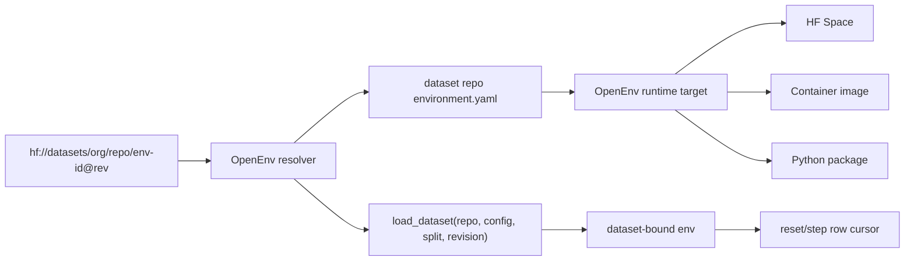

# RFC 006: Hugging Face RL Environment Datasets

**Status**: In Review
**Created**: 2026-05-21
**Authors**: @ben
**RFC ID**: 006

## Summary

This RFC proposes that OpenEnv task sets should be represented as ordinary Hugging Face dataset repositories with a small `environment.yaml` declaration at the dataset repo root. A task set is not a new OpenEnv manifest format and not a new Hub repo type. It is a named RL environment declaration inside a dataset repo, backed by normal dataset files, Dataset Viewer configs, and optional framework-specific runtime metadata.

OpenEnv should consume these declarations through `AutoEnv`. When `AutoEnv` is passed a dataset environment reference such as `hf://datasets/org/repo/env-id@revision`, it should return a dataset-bound environment client. The returned environment has the loaded dataset attached as `env.dataset`, and dataset rows are fed to the runtime automatically through a default row cursor. Users should not need to call a separate task-set resolver in normal evaluation or collection code.

## Motivation

### Problem Statement

OpenEnv currently packages runtimes as Spaces or containers, while tasks are either generated inside an environment, embedded in environment-specific code, or supplied manually by harnesses. RFC 001 already describes tasks as reset-time inputs and separates datasets from the environment runtime, but there is no implemented discovery format for task sets.

The broader ecosystem has converged on dataset-hosted environment artifacts:

- Harbor datasets package task directories and environment requirements.
- Verifiers tasksets load rows from Hugging Face datasets and bind them to a harness.
- OpenEnv environments are deployable runtimes, usually as Spaces or containers.

Without a shared dataset-side declaration, these assets are hard to discover, hard to run from framework clients, and likely to diverge into framework-specific registries.

### Goals

1. Represent OpenEnv task sets as ordinary Hugging Face dataset artifacts.
2. Keep publishing unchanged: users push files to dataset repos as they do today.
3. Move task-set definition into a dataset-root `environment.yaml`.
4. Keep OpenEnv's implementation surface small: resolve, load rows, run runtime.
5. Support framework facets for OpenEnv, Harbor, and Verifiers without requiring any framework to adopt another framework's task schema.
6. Avoid arbitrary remote Python execution by default.
7. Preserve backward compatibility for existing OpenEnv manifests and runtimes.

### Non-Goals

1. No new Hugging Face repo type.
2. No requirement that the Hub execute environments.
3. No replacement for Dataset Viewer configs, Croissant, or dataset cards.
4. No attempt to standardize all RL frameworks or task schemas.
5. No required Dataset Card YAML metadata for RL-environment discovery.
6. No required remote code execution to load a task set.
7. No requirement that all OpenEnv environments expose task sets.

## Design

### Architecture Overview

An RL environment dataset is a Hugging Face dataset repository that includes an optional `environment.yaml` file at its root:

```text
dataset repo
├── README.md
├── environment.yaml
├── data/
│   ├── train-00000-of-00001.parquet
│   └── validation-00000-of-00001.parquet
└── optional assets...
```

The dataset repo owns task-set declarations. The runtime repo, Space, container, or package owns environment execution.



### `environment.yaml`

Dataset repos that want to expose RL environments add this file:

```yaml
spec_version: hf-rl-env-0.1

environments:
  - id: coding
    title: Coding Tasks
    config_name: default
    splits: [train, validation]
    frameworks:
      openenv:
        min_version: ">=0.3.0"
        space_id: openenv/coding_env
```

Required top-level fields:

- `spec_version`: currently `hf-rl-env-0.1`.
- `environments`: non-empty list of environment declarations.

Required per-environment fields:

- `id`: stable identifier within the dataset repo.
- `frameworks`: map of framework declarations the subset is expected to run with.

Optional per-environment fields:

- `title`: human-readable display name.
- `description`: human-readable description.
- `config_name`: matching Dataset Viewer / `datasets.load_dataset` config.
- `splits`: valid split names for this environment subset.
- `dataset`: explicit data locations when Dataset Viewer configs are not enough.
- `runtime`: cross-framework isolation, resource, network, and secret expectations.
- `reward`: scalar/object reward convention when non-standard.

### OpenEnv Framework Declaration

The OpenEnv declaration should be intentionally small. The dataset already implies the repo id and revision; Dataset Viewer metadata already describes config and split layout. OpenEnv only needs to know how to obtain a compatible runtime.

Space-backed runtime:

```yaml
frameworks:
  openenv:
    min_version: ">=0.3.0"
    space_id: openenv/coding_env
```

Container-backed runtime:

```yaml
frameworks:
  openenv:
    min_version: ">=0.3.0"
    image: ghcr.io/openenv/coding_env:0.3.0
```

Package-backed runtime:

```yaml
frameworks:
  openenv:
    min_version: ">=0.3.0"
    package: openenv-coding-env>=0.3.0
```

Exactly one of `space_id`, `image`, or `package` should be specified for the MVP. `manifest` defaults to `openenv.yaml` when a runtime package or Space needs manifest discovery.

Optional OpenEnv fields:

```yaml
frameworks:
  openenv:
    image: ghcr.io/openenv/tbench2:0.3.0
    resources:
      cpus: 4
      memory_gb: 8
      gpus: 0
      network: false
    secrets:
      - HF_TOKEN
```

These fields describe expected runtime needs. They are not executable hooks.

### Environment References

OpenEnv should support a stable reference syntax:

```text
hf://datasets/{repo_id}/{environment_id}@{revision}
```

Examples:

```text
hf://datasets/openenv/coding-tasksets/coding@main
hf://datasets/harborframework/terminal-bench-2.0/terminal-bench-2@2.0
```

The revision is optional and defaults to the dataset repo default branch during experimentation. Reproducible runs should pin a tag or commit SHA.

`AutoEnv` should parse these references directly. A structured reference type may exist internally, but it should not be the primary user-facing API:

```python
env = AutoEnv.from_env(
    "hf://datasets/openenv/coding-tasksets/coding@main",
    split="train",
)
```

### Dataset-Bound Environment Behavior

OpenEnv should avoid requiring users to manually resolve rows or call row-mapping helpers. A dataset environment reference returns a normal environment client with extra dataset attributes:

```python
env.dataset          # loaded Hugging Face dataset split
env.dataset_ref      # parsed hf://datasets/... reference
env.dataset_index    # current row cursor
env.current_row      # row currently bound to the environment, if any
```

Default behavior is cursor-based. On `reset()` with no explicit task kwargs, the dataset-bound environment starts from row `0`. On each environment step, the wrapper advances the row cursor so row `0` corresponds to step `0`, row `1` corresponds to step `1`, and so on. Runtime implementations that need a different interpretation can override this behavior, but simple dataset-backed environments should work without custom client code.

The default row mapping should use a small convention rather than a YAML column-mapping DSL:

1. If the row has `openenv_reset`, pass those fields to `reset()` when the row is used for reset.
2. If the row has `openenv_step`, pass those fields to `step()` when the row is used for a step.
3. Else if the row has `task`, expose `row["task"]` to the runtime.
4. Else expose the whole row to the runtime.

This supports canonical row-based environments, step-indexed datasets, and legacy/specialized runtimes.

Canonical row:

```json
{
  "task_id": "example-001",
  "task": {
    "prompt": [{ "role": "user", "content": "Solve this problem." }],
    "answer": "42",
    "metadata": { "difficulty": "easy" }
  }
}
```

Explicit reset row:

```json
{
  "task_id": "headless-terminal",
  "openenv_reset": {
    "task_id": "headless-terminal"
  },
  "metadata": {
    "source": "terminal-bench-2"
  }
}
```

The OpenEnv runtime must ensure reference answers, hidden tests, and verifier metadata are not leaked to the agent through observations or tool results unless the environment author intentionally exposes them.

### Client API

The primary API should instantiate an environment from either a runtime reference or a dataset environment reference. If the reference points to a dataset, `AutoEnv` returns a dataset-bound environment:

```python
from openenv import AutoEnv

env = AutoEnv.from_env(
    "hf://datasets/openenv/coding-tasksets/coding@main",
    split="train",
    trust_remote_code=False,
)

assert env.dataset is not None

obs = env.reset()       # binds row 0
obs = env.step(action)  # binds row 1 by default
obs = env.step(action)  # binds row 2 by default
```

Evaluation and collection loops can use the environment directly:

```python
from openenv import AutoEnv

env = AutoEnv.from_env(
    "hf://datasets/openenv/coding-tasksets/coding@main",
    split="train",
)

with env:
    obs = env.reset()
    done = False
    while not done:
        action = policy.act(obs)
        result = env.step(action)
        obs = result.observation
        done = result.done
```

`openenv.yaml` inside an OpenEnv runtime may optionally reference a default task set, but should not duplicate the dataset-side schema:

```yaml
task_sets:
  default: hf://datasets/openenv/coding-tasksets/coding@main
```

### Hub Behavior

Hub support is outside the OpenEnv implementation, but this RFC is designed to align with a small Hub feature:

1. Check for `environment.yaml` at the dataset repo root.
2. Parse and validate `environment.yaml`.
3. Add an `Environment` badge and framework facets such as `openenv`, `harbor`, and `verifiers`.
4. Generate framework snippets.
5. Expose a machine-readable endpoint for parsed environment declarations.

OpenEnv should not block on Hub UI support. The framework client can fetch `environment.yaml` directly from the dataset repo.

## Key Design Decisions

- A task set is a dataset-side environment declaration in `environment.yaml`.
- `openenv.yaml` may contain a short reference to a default task set, but the detailed declaration lives in the dataset repo.
- `AutoEnv` returns a dataset-bound environment when given a dataset environment reference. The environment owns the row cursor and applies a simple row convention.
- `environment.yaml` does not execute arbitrary adapter code. Custom behavior belongs in the trusted OpenEnv runtime package, Space, or container image.
- The `frameworks.openenv` block chooses a Space, image, or package. Harbor and Verifiers may use their own framework blocks in the same environment declaration.


## Implementation Plan

### Phase 1: Dataset Environment Resolver

Add a small dataset environment resolver under `src/openenv/core/`:

- dataset environment reference parser for `hf://datasets/...`.
- `EnvironmentDatasetManifest`: Pydantic model for `environment.yaml`.
- dataset-bound environment wrapper that attaches `dataset`, `dataset_ref`, `dataset_index`, and `current_row`.
- row cursor logic for default reset/step row binding.

The resolver should be internal to `AutoEnv`. It fetches `environment.yaml` from the Hugging Face dataset repo using `huggingface_hub`, then loads rows through `datasets.load_dataset` when `datasets` is installed. If `datasets` is not available, return a clear dependency error with the install extra to use.

### Phase 2: AutoEnv Integration

Add:

```python
AutoEnv.from_env(ref: str, *, split: str | None = None, trust_remote_code: bool = False)
```

For `frameworks.openenv.space_id`, this resolves the Space URL and returns a dataset-bound OpenEnv client for that runtime. For `image`, it starts a container through the existing provider path and wraps the client. For `package`, it installs or imports through the existing auto-discovery path and wraps the client.

### Phase 3: CLI Support

Add commands:

```bash
openenv env inspect hf://datasets/org/repo/env-id@rev
openenv env validate path/to/environment.yaml
openenv run hf://datasets/org/repo/env-id@rev --split train
```

`validate` should check schema shape, selected Dataset Viewer config/splits when available, and whether `frameworks.openenv` has exactly one runtime target.

### Phase 4: Reference Environment

Update one existing environment to demonstrate the pattern. Good candidates:

- `reasoning_gym_env`: simple row-based tasks.
- `tbench2_env`: validates explicit `openenv_reset` for task-id based runtimes.

### Phase 5: Documentation

Document:

- How to author `environment.yaml`.
- How to publish an OpenEnv-compatible task set as a HF dataset.
- How to run by `hf://datasets/...`.
- How to pin revisions for reproducible training/evaluation.

## Examples

### Dataset Repository Declaration

```yaml
spec_version: hf-rl-env-0.1

environments:
  - id: terminal-bench-2
    title: Terminal-Bench 2.0
    config_name: harbor_tasks
    splits: [train, validation]
    frameworks:
      harbor:
        min_version: ">=0.1.0"
      verifiers:
        min_version: ">=0.1.14"
        adapter: verifiers.v1.packages.tasksets.HarborTaskset
      openenv:
        min_version: ">=0.3.0"
        space_id: openenv/tbench2_env
```

### Running with OpenEnv

```python
from openenv import AutoEnv

env = AutoEnv.from_env(
    "hf://datasets/harborframework/terminal-bench-2.0/terminal-bench-2@2.0",
    split="train",
    trust_remote_code=False,
)
```

### Dataset-Bound Evaluation Loop

```python
from openenv import AutoEnv

env = AutoEnv.from_env(
    "hf://datasets/openenv/reasoning-gym-tasksets/chain-sum@main",
    split="train",
)

with env:
    obs = env.reset()       # row 0
    obs = env.step(action)  # row 1
    obs = env.step(action)  # row 2
```

### Optional OpenEnv Runtime Default

```yaml
spec_version: 1
name: reasoning_gym
type: space
runtime: fastapi
app: server.app:app
port: 8000

task_sets:
  default: hf://datasets/openenv/reasoning-gym-tasksets/chain-sum@main
```

## Open Questions

1. Should OpenEnv define a package extra such as `openenv-core[tasksets]` for the `datasets` dependency?
2. Should `environment.yaml` live only at the dataset root, or should a dataset config be allowed to carry a colocated declaration in a subdirectory?
3. Should dataset-bound `step()` pass row data through kwargs, through an attached context object, or through an environment-side row provider?
4. Should `openenv_reset` and `openenv_step` be the right names for explicit method kwargs?
5. How should private dataset repos and private Spaces coordinate auth and secrets without storing secret values in metadata?
